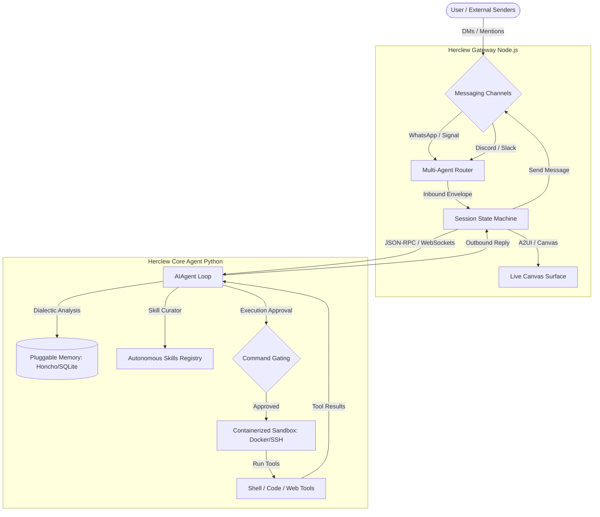

# 🦞 Herclew ☤ — The Ultimate Hybrid AI Agent & Gateway

<p align="center">
  
</p>

<p align="center">
  <strong>The self-improving reasoning engine meets the universal messaging gateway.</strong>
</p>

<p align="center">
  <a href="#architecture"></a>
  <a href="#quick-start"></a>
  <a href="LICENSE"></a>
</p>

---

## 🌟 Welcome to Herclew

**Herclew** is a premium monorepo that combines the best of **Hermes Agent** (the self-improving reasoning loop by Nous Research) and **OpenClaw** (the multi-channel gateway control plane). 

By uniting a **TypeScript Gateway** with a **Python Reasoning Core**, Herclew allows you to run a highly secure, voice-enabled, self-improving agent that handles inbound messages from Telegram, Discord, WhatsApp, Slack, and Signal, routes them to isolated local sandboxes, and persistent dialectic memories.

---

## 🏛️ Architecture

Herclew operates as a hybrid decoupled system. The **TypeScript Gateway** owns the connection interfaces, audio pipelines, and macOS/iOS/Android canvas rendering, while the **Python Core** owns the planning, tools execution, and dialectic learning.



---

## ⚡ Key Highlights

| Feature | `core-agent` (Python Core) | `gateway-node` (TS Gateway) | Herclew Combined Advantage |
| :--- | :--- | :--- | :--- |
| **Learning Loop** | 🧠 Built-in dialectic user profile & skill auto-curator | ❌ Static configuration | **Adaptive, self-improving messaging workflows** |
| **Integrations** | CLI & basic Slack/Telegram | 📱 25+ channels (WhatsApp, Signal, iMessage, Discord, Matrix...) | **Universal platform coverage with voice & canvas** |
| **Execution** | Local PTY, Docker, Modal, Vercel | Docker sandboxes, SSH | **Zero-trust sandboxed multi-platform tool execution** |
| **Voice / Media** | Faster-Whisper, TTS providers | macOS Voice Wake, MLX-TTS, Android continuous voice | **Continuous voice conversations over active chat channels** |

---

## 🚀 Quick Start

Herclew is organized as a monorepo. You can run the **Gateway** and **Core Agent** together on a local machine, a VPS, or split them across cloud providers.

### Prerequisites
- **Node.js** >= 22 (recommended Node 24) + `pnpm`
- **Python** >= 3.11 + `uv`

---

### Step 1: Set up Herclew Core Agent (Python)

Navigate to the `core-agent` directory to install and start the CLI:

```bash
cd core-agent

# Install uv package manager if missing
curl -LsSf https://astral.sh/uv/install.sh | sh

# Install core agent in editable mode with development/web tools
uv pip install -e ".[all]"

# Configure your model provider (e.g. OpenRouter, OpenAI, Anthropic)
herclew model

# Start chatting locally!
herclew
```

### Step 2: Set up Herclew Gateway (Node.js)

Navigate to the `gateway-node` directory to set up channels (e.g., Telegram, Discord, WhatsApp) and bridge them:

```bash
cd gateway-node

# Install workspace dependencies
pnpm install

# Run the setup wizard to connect your first channel
pnpm openclaw setup

# Launch the gateway
pnpm gateway:watch
```

Once paired, Herclew will automatically route incoming messages from your configured channels directly into the Python Reasoning Core.

---

## 🛠️ Slash Command Quick Ref

Herclew supports slash commands in both the CLI terminal and messaging platforms:

| Command | Action | Platform Availability |
| :--- | :--- | :--- |
| `/new` or `/reset` | Start a completely fresh conversation | CLI & Messaging |
| `/model [name]` | Dynamically switch LLM models | CLI & Messaging |
| `/skills` | Browse, edit, or check active skills | CLI & Messaging |
| `/status` | View active platform connections and gateway metrics | Messaging only |
| `/retry` | Undo the last turn and retry model generation | CLI & Messaging |
| `/compress` | Compress conversation history to save context budget | CLI & Messaging |

---

## 🔒 Security & Sandboxing

Treat all remote channel inputs as **untrusted**. By default:
- **Approval Gating**: Commands and tools run on the host for your own local terminal, but you can enforce explicit confirmation for high-risk operations (e.g. writing files, executing bash commands).
- **Docker Sandboxing**: Set `agents.defaults.sandbox.mode: "non-main"` in your gateway config to isolate multi-user channel interactions inside containers.

---

## 🤝 Contributing

We welcome contributions! Please see [CONTRIBUTING.md](CONTRIBUTING.md) for details on code style, linting/testing configurations, and pull requests.
